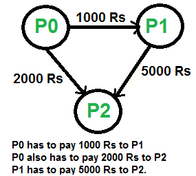
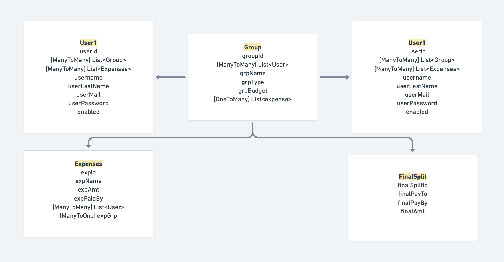
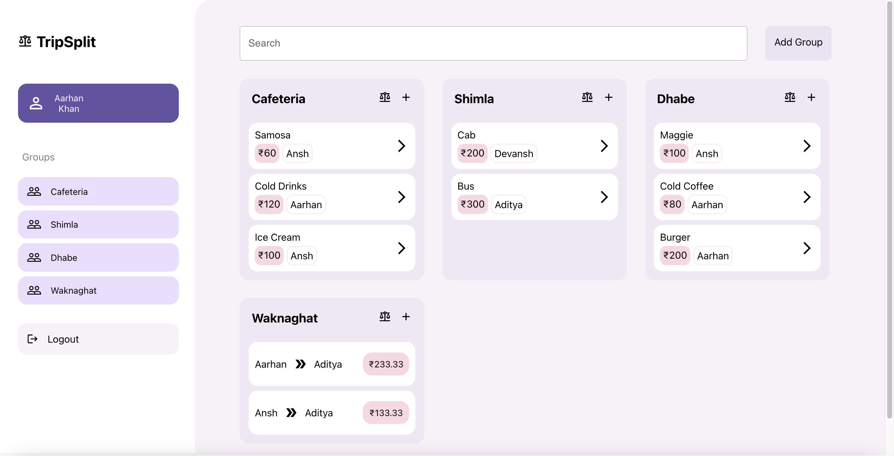

## SplitWise - FindCoder.io Hackathon Submission

 

Full stack application to split bills among friends ;)

Frontend : https://tripsplits.netlify.app/register

Backend : https://github.com/aarhank/TripSplit-Backend

### Get started

A bill spliting application, uses a greedy algorithm to give the min number of transactions to resolve the expenses, also reduces the complexity.

Application consists of a Frontend and a Backend, Backend made using springboot with fully scalable code database used is AWS RDS, Frontend is made using reactJS made use of mui library to design responsive components.

### Features

* User Sigin and Signup functionality   
  Takes user name and email as parameters, stores hashed password. 

* Create Group, can add multiple users
  Takes group name,budget,type and members, can select from all users in the database.
  
* Create Expenses, select multiple users to split equally   
  Takes expense name,amount,paidby and splitbtw as parameters.

* Generates minimum number of transactions and reduce the complexity of expenses.
  This uses a greedy algorithm at every step, settle all amounts of one person and recur for remaining n-1 persons. 
  
* Full functioning backend, database used AWS RDS
  Backend made using spring boot, with a sql database.

### Algorithm

* Compute the net amount for every person. The net amount for person ‘i’ can be computed by subtracting sum of all debts from sum of all credits.
* Find the two persons that are maximum creditor and maximum debtor. Let the maximum amount to be credited maximum creditor be maxCredit and maximum amount to be debited from maximum debtor be maxDebit. Let the maximum debtor be Pd and maximum creditor be Pc.
* Find the minimum of maxDebit and maxCredit. Let minimum of two be x. Debit ‘x’ from Pd and credit this amount to Pc
* If x is equal to maxCredit, then remove Pc from set of persons and recur for remaining (n-1) persons.
* If x is equal to maxDebit, then remove Pd from set of persons and recur for remaining (n-1) persons.

### Backend Design

### Examples

